<div align="center">



[](mailto:franz@sigsolutions.co.za)
[](https://sigsolutions.co.za)
[](https://linkedin.com/in/franzbadenhorst)
[](https://x.com/FranzSalesSense)

</div>

---

I build the systems between ad spend and a closed sale: lead capture, contact warehousing, dialler logic and AI qualification, run across a 50+ seat call centre and the businesses it sells for. One number decides whether any of it stays: **cost per closed sale**.

```ts
const franz = {
  base:       "Pretoria, South Africa",
  role:       "COO/CSO and equity partner across a South African portfolio",
  builds:     "revenue infrastructure",
  removes:    "humans copying numbers between systems",
  measuredBy: "cost per closed sale",
};
```

## The pipeline I build

```
 ┌──────────────┐   ┌──────────────┐   ┌──────────────┐   ┌──────────────┐
 │   META ADS   │   │   CONTACT    │   │   VICIDIAL   │   │  AGENT + AI  │
 │ instant form │──▶│  warehouse   │──▶│  campaign +  │──▶│qualification │──▶  CLOSED SALE
 │    + CAPI    │   │dedup · POPIA │   │  list logic  │   │  + routing   │
 └──────────────┘   └──────────────┘   └──────────────┘   └──────────────┘
         ▲                                                                          │
         └─────────────────── cost per closed sale feeds bidding ───────────────────┘
```

> [!NOTE]
> Every box above replaced a spreadsheet, a WhatsApp group or a person copying numbers between two systems.

## Systems I ship

```
Lead acquisition     Meta Ads pipelines, instant form routing, CAPI integrations,
                     petition funnels, audience compounding, cost-per-sale tracking

Dialler systems      ViciDial campaign builds, dialler-safe exports, duplicate
                     suppression, revenue-per-list analytics, contact lifecycle

Data infrastructure  Supabase and Postgres warehouses, batch validation, cross-entity
                     dedup, SA telecom normalisation, campaign reconciliation

AI workflows         Autonomous ad creative pipelines, voice qualification agents,
                     agent-orchestrated routing, LLM-assisted compliance gating
```

## Stack

<table>
<tr>
<td valign="top" width="33%">

**Build**


</td>
<td valign="top" width="33%">

**Run**


</td>
<td valign="top" width="33%">

**Sell**


</td>
</tr>
</table>

## Current projects

| | Project | What it is |
|---|---|---|
| ☎️ | **[SIG Solutions](https://sigsolutions.co.za)** | 50+ seat outbound BPO with owned dialler infrastructure and AI voice routing |
| 🛡 | **[Acorn Brokers](https://acornbrokers.co.za)** | Authorised FSP distributing legal protection products to licensed SA firearm owners |
| 🏛 | **[Civil Society South Africa](https://civilsocietysouthafrica.co.za)** | Civic advocacy NGO running broad-mandate campaigns on minority-impacting issues |
| 📈 | **[Stacked Marketing](https://stackedmarketing.co.za)** | AI-enabled performance marketing agency |
| 📝 | **[LicenceReady](https://licenceready.co.za)** | Firearm motivation letter generator with localised crime data and guided next steps |

<details>
<summary><b>How I decide what to build</b></summary>

<br>

If a task repeats more than weekly, has a defined input and a defined output, and a mistake costs money, it gets built. If it needs judgement that changes with context, it stays with a human and gets better tooling instead.

The measure is never impressions, engagement or raw lead count. It is cost per closed sale, because that is the only number that survives contact with a P&L.

</details>

---

```
Infrastructure > aesthetics
Control        > dependency
Ownership      > outsourcing
Systems        > hacks
```

<div align="center">
<sub>Open to conversations about call-centre automation, lead-gen infrastructure and AI in regulated financial services.</sub>
</div>
