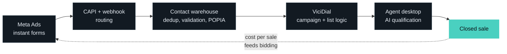

<div align="center">


<a href="https://github.com/DenverCoder1/readme-typing-svg"></a>

[](mailto:franz@sigsolutions.co.za)
[](https://sigsolutions.co.za)
[](https://linkedin.com/in/your-handle)

</div>

---

```ts
const franz = {
  location: "Pretoria, South Africa",
  focus:    "Revenue infrastructure: the systems between ad spend and closed sales",
  stack:    ["TypeScript", "React", "Next.js", "Node.js", "Python", "PostgreSQL", "Supabase"],
  infra:    ["ViciDial", "FreePBX", "FFmpeg", "Playwright", "GoHighLevel"],
  ai:       ["Claude", "ElevenLabs", "n8n", "Make"],
  metric:   "cost per closed sale",
};
```

## The pipeline I build



> [!NOTE]
> Everything below exists because a spreadsheet, a WhatsApp group or a person copying numbers between two systems used to sit where the code now sits.

## Stack

<table>
<tr>
<td valign="top" width="33%">

**Build**


</td>
<td valign="top" width="33%">

**Run**


</td>
<td valign="top" width="33%">

**Sell**


</td>
</tr>
</table>

## Current projects

| | Project | What it is |
|---|---|---|
| 🛡 | **[Acorn Brokers](https://acornbrokers.co.za)** | Legal liability acquisition engine for SA firearm owners |
| ☎️ | **[SIG Solutions](https://sigsolutions.co.za)** | BPO call centre with dialler infrastructure and AI voice routing |
| 🏛 | **[Civil Society South Africa](https://civilsocietysouthafrica.co.za)** | Civic advocacy NGO running broad-mandate campaigns on minority-impacting issues |
| 📈 | **[Stacked Marketing](https://stackedmarketing.co.za)** | AI-enabled performance marketing agency |
| 📝 | **[LicenceReady](https://licenceready.co.za)** | Firearm motivation letter generator with localised crime data and guided next steps |

## Systems I ship

```
Lead acquisition     Meta Ads pipelines, instant form routing, CAPI integrations,
                     petition funnels, audience compounding, cost-per-sale tracking

Dialler systems      ViciDial campaign builds, dialler-safe exports, duplicate
                     suppression, revenue-per-list analytics, contact lifecycle mgmt

Data infrastructure  Supabase and Postgres warehouses, batch validation, cross-entity
                     dedup, SA telecom normalisation, campaign reconciliation

AI workflows         Autonomous ad creative pipelines, voice qualification agents,
                     agent-orchestrated routing, LLM-assisted compliance gating
```

<details>
<summary><b>How I decide what to build</b></summary>

<br>

Every system above replaced a person doing the same thing by hand, badly, at scale. The test is simple: if a task is repeated more than weekly, has a defined input and a defined output, and a mistake costs money, it gets built. If it needs judgement that changes with context, it stays with a human and gets better tooling instead.

The measure is never engagement, impressions or leads. It is cost per closed sale, because that is the only number that survives contact with a P&L.

</details>

## Activity

<div align="center">

<picture>
  <source media="(prefers-color-scheme: dark)" srcset="./dist/github-snake-dark.svg" />
  <source media="(prefers-color-scheme: light)" srcset="./dist/github-snake.svg" />
  
</picture>

<br><br>


</div>

---

```
Infrastructure > aesthetics
Control        > dependency
Ownership      > outsourcing
Systems        > hacks
```

<div align="center">
<sub>Open to conversations about call-centre automation, lead-gen infrastructure and AI in regulated financial services.</sub>
</div>
